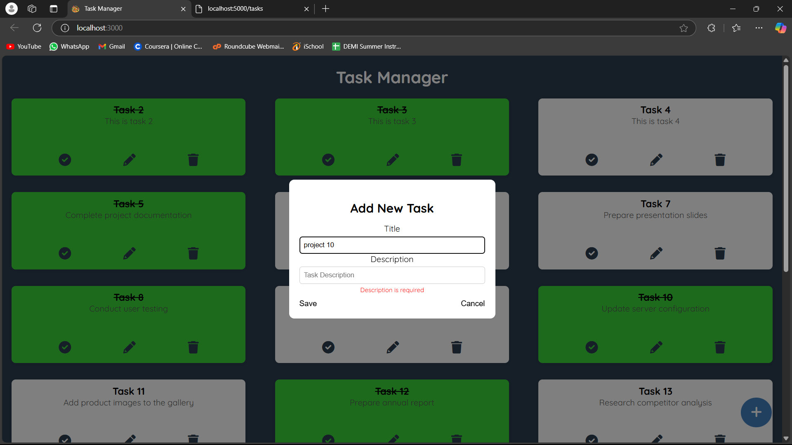
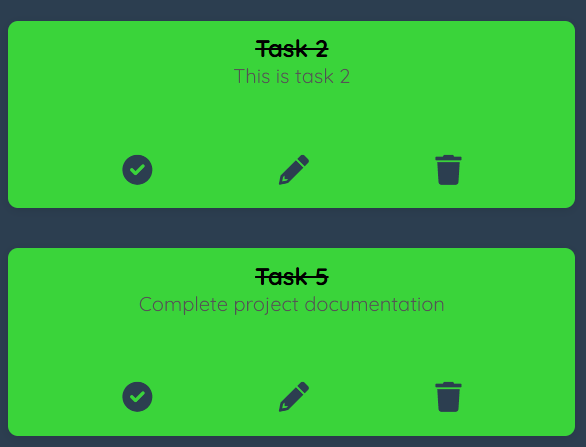
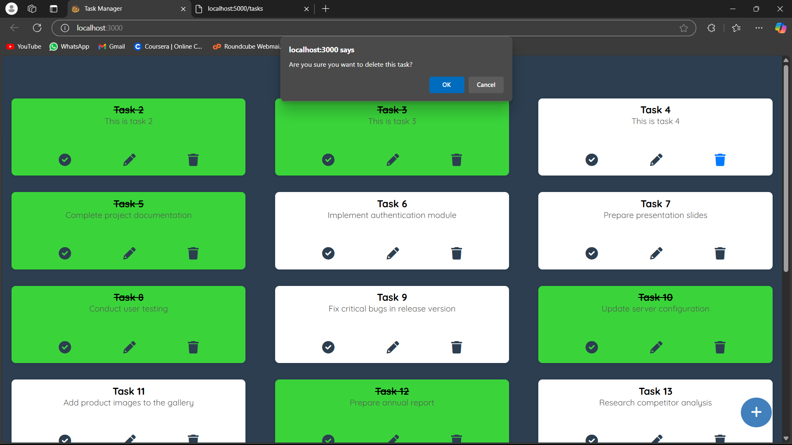
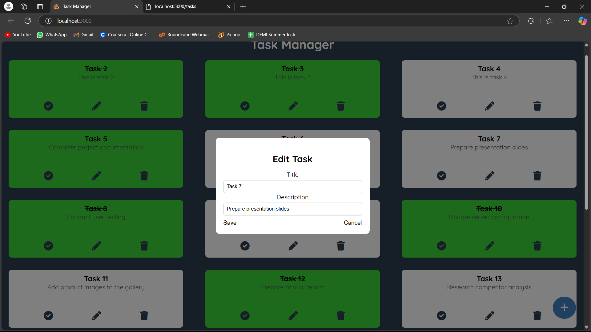
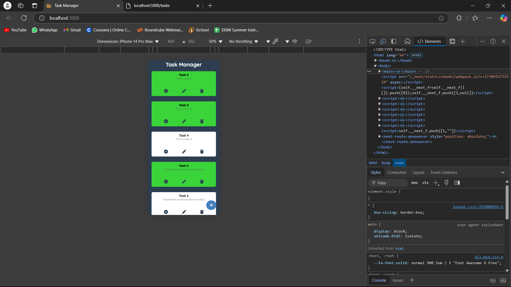

# Task Manager Application

This is a Task Manager application built using **React** and **Next.js**. The app provides an intuitive and easy-to-use interface for managing tasks, allowing users to add, edit, complete, and delete tasks.

## Features

- **Add New Tasks**: Users can create new tasks with titles and descriptions.
  
   

- **Mark Tasks as Completed**: Users can mark tasks as completed, which applies a strikethrough to indicate completion.
  
   

- **Edit and Delete Tasks**: Each task card has options to edit or delete the task.
  
  
   

- **Responsive Design**: Ensures a consistent user experience on mobile, tablet, and desktop screens.
  
   

- **Persistent State**: Uses browser storage or backend (optional) for task data persistence.

## Technologies Used

- **React**: For building the UI components.
- **Next.js**: To handle routing and server-side rendering.
- **CSS**: Custom styling for components and responsive design.

# TaskManager
